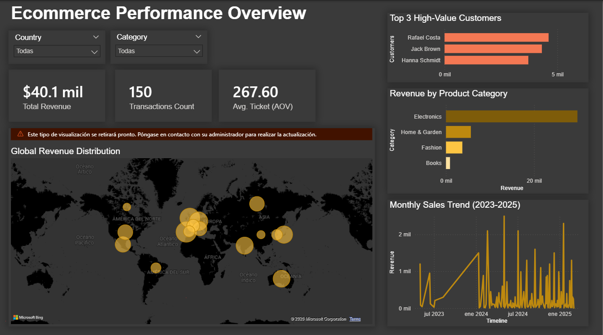
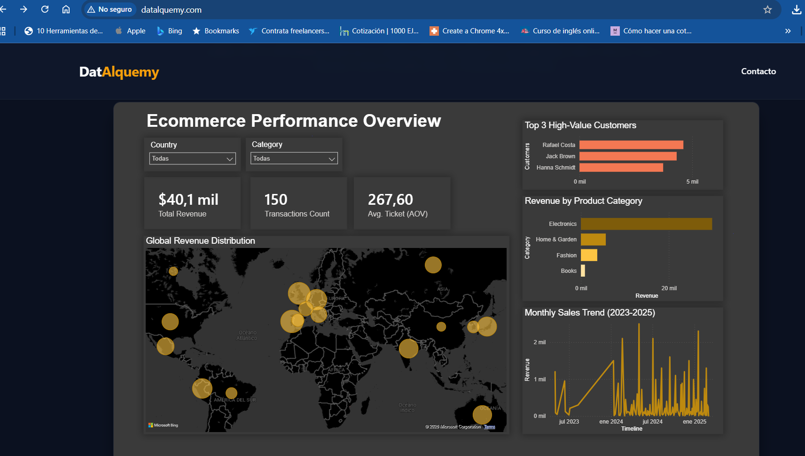

# E-commerce Data Pipeline Challenge

## Descripción

Este proyecto implementa un **pipeline de datos reproducible de extremo a extremo** para procesar y analizar información de una startup de comercio electrónico.

La solución está diseñada siguiendo un enfoque de **arquitectura por capas**, separando claramente:

- **Control Plane** (validación y gobernanza de datos)
- **Data Plane** (transformación de datos)
- **Load Layer** (persistencia del modelo analítico)

El objetivo es demostrar buenas prácticas de **ingeniería de datos**, incluyendo:

- pipelines reproducibles  
- validación de datos  
- modelado analítico  
- consultas SQL  
- integración con herramientas de BI  

---

# Arquitectura del Sistema

El flujo de datos sigue la siguiente arquitectura lógica:
```
Raw Data Sources (CSV / JSON)
        │
        ▼
Control Plane (Data Validation & Data Quality)
        │
        ▼
Data Plane (Transformations in Python)
        │
        ▼
Load Layer (SQLite Persistence)
        │
        ▼
Analytical Warehouse (SQLite)
        │
        ▼
SQL Analytics Layer
        │
        ▼
Power BI Dashboard
```
Esta separación permite:

- detectar errores antes de procesar datos  
- mantener trazabilidad de la calidad del pipeline  
- asegurar reproducibilidad del análisis  

---

# Estructura del Proyecto

```
.
├── data/                         # Datos fuente (CSV / JSON)
│
├── scripts/                      # Motor del pipeline
│   ├── control_plane_validation.py
│   ├── transform.py
│   ├── load.py
│   └── run_pipeline.py
│
├── sql/                          # Consultas analíticas
│   ├── 01_top_users.sql
│   ├── 02_revenue_by_country.sql
│   ├── 03_transactions_by_user.sql
│   ├── 04_average_order_value.sql
│   └── 05_data_quality_checks.sql
│
├── output/                       # Resultados generados por el pipeline
│   │
│   ├── dim_users.csv
│   ├── fact_transactions.csv
│   ├── dq_report.txt
│   ├── transform_report.txt
│   │
│   ├── ecommerce.db              # SQLite analytical warehouse
│   │
│   ├── eCommerceReport.pbix      # Power BI report (archivo editable)
│   ├── eCommerceReport.pdf       # Versión exportada del dashboard
│   │
│   ├── dashboard_screenshots/    # Capturas adicionales del dashboard
│   │
│   └── figures/
│       ├── .gitkeep
│       └── dtqOpexPorfolio.png   # Screenshot pagina web
│       └── ecommercebi.png.png   # Screenshot principal del dashboard
│
├── requirements.txt
└── README.md
```

La carpeta **output/** se genera automáticamente al ejecutar el pipeline.

---

# Flujo Interno del Pipeline

El pipeline se ejecuta desde:

scripts/run_pipeline.py

Este script coordina las tres capas principales del sistema.

### 1️⃣ Control Plane

Ejecuta:

control_plane_validation.py

Valida:

- consistencia de esquemas  
- tipos de datos esperados  
- reglas básicas de integridad  

Genera:

output/dq_report.txt

Este reporte permite **auditar la calidad del dato antes de procesarlo**.

---

### 2️⃣ Data Plane (Transformación)

Ejecuta:

transform.py

Responsabilidades:

- lectura de `transactions.csv`
- lectura de `user_data.json`
- aplanado de JSON
- limpieza de datos
- normalización de fechas
- generación del modelo analítico

Artefactos generados:

output/dim_users.csv  
output/fact_transactions.csv  
output/transform_report.txt

El archivo **transform_report.txt** documenta:

- número de registros procesados
- registros descartados
- eventos de transformación
- normalización de fechas aplicada

---

### 3️⃣ Load Layer

Ejecuta:

load.py

Responsabilidades:

- leer los artefactos generados por `transform.py`
- construir el modelo relacional
- persistir las tablas analíticas en SQLite

Entradas:

output/dim_users.csv  
output/fact_transactions.csv

Salida:

output/ecommerce.db

La base generada funciona como **Analytical Warehouse** para consultas SQL y herramientas BI.

---

# Normalización de Fechas

Los datos fuente contienen **formatos de fecha inconsistentes** (DMY / YMD y distintos separadores).

Se implementó una lógica que:

- detecta formatos mediante expresiones regulares  
- convierte fechas a un formato consistente  
- marca registros no interpretables como **UNPARSEABLE**

Esto evita pérdida silenciosa de datos y permite auditoría posterior.

---

# Tratamiento de Valores Nulos en `amount`

Los valores nulos en **amount** se excluyen en la capa analítica.

Justificación:

Imputar valores en transacciones financieras puede distorsionar métricas clave como:

- **Total Revenue**
- **Average Order Value (AOV)**

Por lo tanto, los registros incompletos se excluyen de los cálculos analíticos.

---

# Consultas Analíticas

Las consultas SQL se encuentran en:

sql/

Pueden ejecutarse con SQLite:

sqlite3 output/ecommerce.db

Ejemplo:

.headers on  
.mode column  
.read sql/01_top_users.sql

Estas consultas permiten responder preguntas de negocio como:

- usuarios con mayor generación de ingresos  
- ingresos por país  
- valor promedio de orden  
- validaciones de calidad de datos  

---

# Ejecución del Pipeline

Para ejecutar el pipeline completo:

pip install -r requirements.txt  
python scripts/run_pipeline.py

Esto ejecuta:

1️⃣ Control Plane  
2️⃣ Data Plane  
3️⃣ Load Layer  

Y genera:

- base analítica SQLite  
- reportes de validación  
- reportes de transformación  

---

# Prueba de Reproducibilidad

Para validar que el proyecto puede ejecutarse desde cero en un entorno limpio se realizó la siguiente prueba.

El objetivo es garantizar que cualquier evaluador técnico pueda:

- clonar el repositorio  
- crear un entorno virtual nuevo  
- instalar dependencias  
- ejecutar el pipeline  
- obtener los artefactos esperados  

---

## Paso 1 — Clonar el repositorio

cd D:\  
mkdir _repro_test  
cd _repro_test  

git clone https://github.com/Datalquemy/opex-ecommerce-etl-challenge.git  
cd opex-ecommerce-etl-challenge  

---

## Paso 2 — Crear un entorno virtual limpio

python -m venv .venv  
.\.venv\Scripts\Activate.ps1  

python -m pip install --upgrade pip  
pip install -r requirements.txt  

---

## Paso 3 — Ejecutar el pipeline

python scripts/run_pipeline.py

Esto ejecuta todo el flujo del pipeline.

---

## Paso 4 — Verificar artefactos generados

dir output

Artefactos esperados:

dq_report.txt  
transform_report.txt  
dim_users.csv  
fact_transactions.csv  
ecommerce.db  

Estos archivos confirman que el pipeline se ejecutó correctamente y que el modelo analítico fue generado.

---

## Visualización en Power BI

El *Analytical Warehouse* (`output/ecommerce.db`) se conecta a Power BI mediante **SQLite ODBC** para construir un dashboard ejecutivo e interactivo.

> Nota: El reporte puede abrirse para revisión y storytelling. Si el evaluador desea **refrescar** los datos desde `ecommerce.db`, entonces sí requerirá tener instalado el driver ODBC de SQLite y que exista el archivo `output/ecommerce.db` (generado al correr el pipeline).

### Dashboard: *Ecommerce Performance Overview* (Dark Theme)

El dashboard fue diseñado con enfoque de **storytelling ejecutivo** (lectura rápida de KPIs + desglose por clientes, geografía, categoría y tendencia temporal).

#### 1) Filtros globales (Slicers)
En la parte superior se incluyen filtros interactivos que afectan todas las visualizaciones:
- **Country**
- **Category**

#### 2) Indicadores clave (KPI Cards)
Tres tarjetas resumen el estado del negocio:
- **Total Revenue**: ingreso total generado por las transacciones.
- **Transactions Count**: número total de transacciones registradas.
- **Avg. Ticket (AOV)**: ticket promedio calculado como `Total Revenue / Transactions Count`.

#### 3) Distribución geográfica
Visualización tipo **mapa mundial con burbujas** (*Global Revenue Distribution*), útil para identificar:
- presencia geográfica del negocio
- concentración de ingresos/actividad por región

#### 4) Clientes de alto valor
Panel **Top 3 High-Value Customers** con gráfico de barras horizontal para destacar rápidamente los clientes con mayor gasto acumulado.

#### 5) Ingresos por categoría
Visualización **Revenue by Product Category** para comparar el desempeño por línea de producto y apoyar decisiones comerciales.

#### 6) Tendencia temporal de ventas
Gráfico **Monthly Sales Trend (2023–2025)** para observar:
- estacionalidad
- picos de ventas
- cambios de comportamiento a lo largo del tiempo

Archivo del reporte: `output/eCommerceReport.pbix` (entregado como artefacto final).

### Power BI Dashboard



## Acceso al Reporte (Live & Offline)

El dashboard está disponible en diferentes formatos para facilitar su revisión.

### Versión Interactiva (Web)

Ver dashboard en producción:  
https://www.datalquemy.com

Visualización interactiva sin necesidad de instalar software.
### Vista previa




### Archivo de Origen (Power BI)

`output/eCommerceReport.pbix`

Permite abrir el modelo directamente en Power BI Desktop.
>Nota: Se debe tener la última actualización

### Versión Pdf

El archivo esta en formato pdf disponible en output/eCommerceReport.pdf

# Objetivo del Dashboard

El dashboard permite responder preguntas clave de negocio:

- ¿Cómo se comportan los ingresos globales?  
- ¿Qué países generan más usuarios o ventas?  
- ¿Quiénes son los clientes de mayor valor?  
- ¿Existen patrones temporales en las ventas?  

---

# Autor

Emmanuel Pérez
